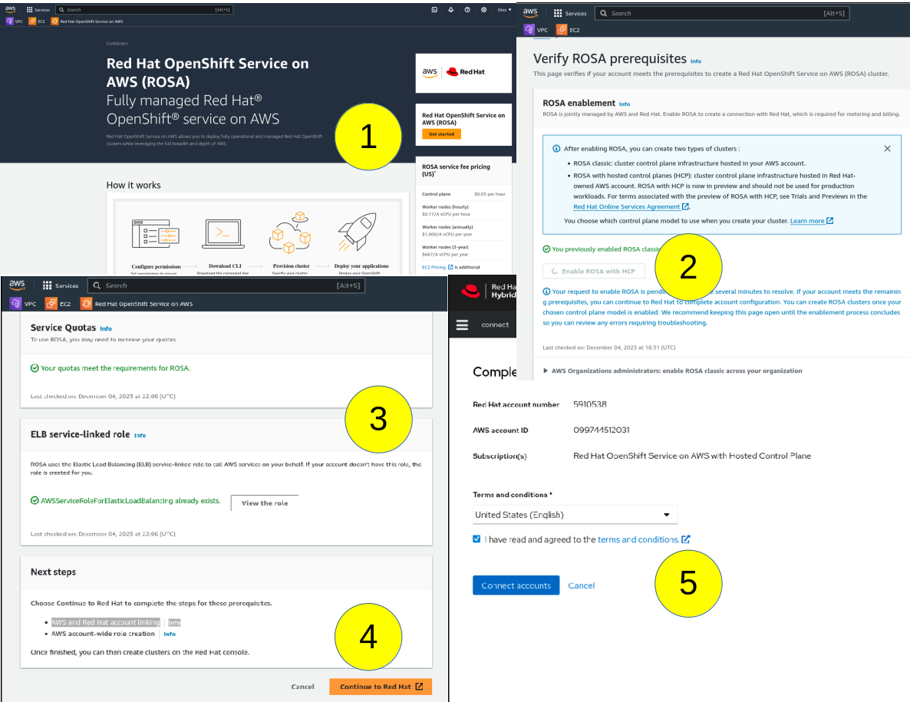

# Kubernetes Cluster Setup (EKS, GKE, AKS, K8S, ROSA)

Below are standard terraform commands to setup any cluster type. Follow the additional instructions for specific cluster types as mentioned below.

    terraform init
    terraform plan
    terraform apply -auto-approve -input=false

Create AWS ECR using the `aws/ecr` terraform scripts. After cluster creation is complete setup `ecr-secret` to pull docker images from AWS ECR.
**NOTE**: Replace the example AWS Account ID `012345678901` to set the `AWS_ACCOUNT_ID` environment variable.

    export AWS_REGION=us-east-1
    export AWS_ACCOUNT_ID=012345678901

    aws sts get-caller-identity --region $AWS_REGION

    kubectl create namespace emprovise-system

    kubectl delete secret docker-registry ecr-secret --namespace=emprovise-system
    
    kubectl create secret \
    docker-registry ecr-secret \
    --docker-server="$AWS_ACCOUNT_ID.dkr.ecr.$AWS_REGION.amazonaws.com" \
    --docker-username=AWS \
    --docker-password="$(aws ecr get-login-password --region $AWS_REGION)" \
    --docker-email=emprovise@gmail.com \
    --namespace emprovise-system

    kubectl get secret ecr-secret --namespace=emprovise-system -o yaml
    kubectl secrets link default ecr-secret --for=pull --namespace=emprovise-system

Install Helm

    helm uninstall emprovise -n emprovise-system
    helm install emprovise --namespace emprovise-system --create-namespace --values overrides.yaml

Commands to Check pods and logs

    kubectl get pods -A
    kubectl get events -n emprovise-system
    kubectl get nodes --show-labels

## Amazon Webservices (AWS) EKS Setup

NOTE: EKS cluster creation and destruction takes 7-8 minutes.

Run the following AWS CLI command to automatically update the `~/.kube/config` file with the necessary access details:

    aws eks --region us-east-1 update-kubeconfig --name nova-test-eks-cluster

    kubectl get nodes

## Native Kubernetes using Kind on AWS EC2 Setup

Use below commands to login into AWS EC2 instance.

    ssh -i ~/.ssh/<STACK_NAME>-ec2-key.pem ubuntu@<EC2_INSTANCE_ID>.compute-1.amazonaws.com
    sftp -i ~/.ssh/<STACK_NAME>-ec2-key.pem ubuntu@<EC2_INSTANCE_ID>.compute-1.amazonaws.com

## Google Cloud Platform (GCP) GKE Setup

Download [GCP SDK](https://cloud.google.com/sdk/docs/install-sdk) and extract its contents.
Then use install script `install.sh` to add gcloud CLI tools to your PATH. It will also install Python 3.11 required for GCP CLI.

    ./google-cloud-sdk/install.sh

To initialize the gcloud CLI, run gcloud init:

    ./google-cloud-sdk/bin/gcloud init

Ensure you've set up Google Cloud SDK, enabled Kubernetes Engine API, and set up application credentials:

    gcloud auth application-default login
    gcloud services enable container.googleapis.com

Get the latest version of GCloud components including GCloud CLI

    gcloud components update

Kubectl and other Kubernetes clients require an authentication plugin, [gke-gcloud-auth-plugin](https://cloud.google.com/kubernetes-engine/docs/how-to/cluster-access-for-kubectl#install_plugin), which uses the Client-go Credential Plugins framework to provide authentication tokens to communicate with GKE clusters.
Before Kubernetes version 1.26 is released, gcloud CLI will start to require that the gke-gcloud-auth-plugin binary is installed. If not installed, existing installations of kubectl or other custom Kubernetes clients will stop working.

    gcloud components install gke-gcloud-auth-plugin

    gke-gcloud-auth-plugin --version

    gcloud container clusters get-credentials CLUSTER_NAME --region=COMPUTE_REGION

    kubectl get namespaces

To view the environment's kubeconfig, run the following command:

    kubectl config view

When we create a cluster using gcloud container clusters create-auto, an entry is automatically added to the kubeconfig file in your environment, and the current context changes to that cluster. For example:

    gcloud container clusters create-auto my-cluster

To view the current context for kubectl, run the following command:

    kubectl config current-context

GKE cluster can be deleted using clusters delete command as below:

    gcloud container clusters delete CLUSTER_NAME

## Azure Kubernetes Service (AKS) Setup

Install [Azure CLI](https://learn.microsoft.com/en-us/cli/azure/install-azure-cli).

Install the Azure CLI on macOS by updating the brew repository information:

    brew update && brew install azure-cli

Login via Azure CLI. Browser will pop out and login via MS Authenticator as usually. Then go back to Terminal to select Subscription `C1 Cloud Native Security`.

    az login

    A web browser has been opened at https://login.microsoftonline.com/organizations/oauth2/v2.0/authorize. Please continue the login in the web browser. If no web browser is available or if the web browser fails to open, use device code flow with `az login --use-device-code`.
    Retrieving tenants and subscriptions for the selection...
    [Tenant and subscription selection]
    No     Subscription name             Subscription ID                       Tenant
    -----  ----------------------------  ------------------------------------  ----------
    [1] *  Demo Account                  428f8s02-7g32-6788-x219-v38ww42n872d  Emprovise
    [2]    Prod Account                  783g4w03-4t71-2311-r754-d67ww42n291j  Emprovise

    The default is marked with an *; the default tenant is 'Emprovise' and subscription is 'Demo Account' (428f8s02-7g32-6788-x219-v38ww42n872d).
    Select a subscription and tenant (Type a number or Enter for no changes): 2       
    Tenant: Emprovise
    Subscription: Prod Account (783g4w03-4t71-2311-r754-d67ww42n291j)

Run `az account` show command to verify account information

    az account show

Connect AKS: az aks get-credentials --resource-group {resource group} --name {cluster name}

    az aks get-credentials --resource-group Emprovise-Resource-Group --name nova-test-aks-cluster

## OpenShift ROSA Cluster Setup

- An AWS account with enough quota value to meet the minimum requirements for ROSA (100)
- AWS Access Key and your AWS Secret Access Key

> [!IMPORTANT]
> Enable the ROSA service in the AWS Console and link the AWS and Red Hat accounts by following this procedure:
Sign in to your AWS account, from to the AWS Console look for the “Red Hat OpenShift Service on AWS (ROSA)” and click the “Get started” button (1), then locate and enable the “ROSA with HCP” service (2);
ensure Service Quotas meet the requirements and Elastic Load Balancing (ELB) service-linked role already exists (3); click the “Continue to Red Hat” button (4); complete the connection by clicking the “Connect accounts” button (5).

Once done your AWS and Red Hat account are linked and you can start with the installation process.

First install Red Hat [OpenShift Service on AWS (ROSA) command-line interface (CLI) tool](https://docs.openshift.com/rosa/rosa_install_access_delete_clusters/rosa_getting_started_iam/rosa-installing-rosa.html).
Download the latest release of the ROSA CLI for your operating system. Rename the executable to `rosa` and add `rosa` to your path.

    mv rosa /usr/local/bin/rosa

In order to Red Hat OpenShift Service on AWS cluster we need to export the [offline Red Hat OpenShift Cluster Manager token](https://console.redhat.com/openshift/token).
Go to [OpenShift Cluster Manager API Token](https://console.redhat.com/openshift/token), click `Load Token` to view the token. Copy the offline token, and set the token as an environmental variable by running the below command:

    export RHCS_TOKEN=<openshift_offline_token>
